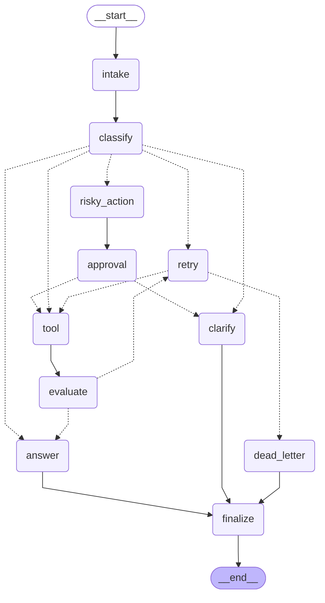

# Day 08 Lab Report

## 1. Team / student

- Name:
- Repo/commit:
- Date:

## 2. Architecture

Describe your graph nodes, edges, state fields, and reducers.

### Graph Diagram

## 3. State schema

List important fields and whether they are overwrite or append-only.

| Field | Reducer | Why |
|---|---|---|
| messages | append | audit conversation/events |
| route | overwrite | current route only |

## 4. Scenario results

**Total Scenarios:** 7 | **Success Rate:** 100% | **Avg Nodes Visited:** 6.4 | **Total Retries:** 0 | **Total Interrupts:** 2

| Scenario | Expected route | Actual route | Success | Retries | Interrupts |
|---|---|---|---:|---:|---:|
| S01_simple | simple | simple | ✅ | 0 | 0 |
| S02_tool | tool | tool | ✅ | 0 | 0 |
| S03_missing | missing_info | missing_info | ✅ | 0 | 0 |
| S04_risky | risky | risky | ✅ | 0 | 1 |
| S05_error | error | error | ✅ | 0 | 0 |
| S06_delete | risky | risky | ✅ | 0 | 1 |
| S07_dead_letter | error | error | ✅ | 0 | 0 |

## 5. Failure analysis

Describe at least two failure modes you considered:

1. Retry or tool failure:
2. Risky action without approval:

## 6. Persistence / recovery evidence

Explain how you used checkpointer, thread id, state history, or crash-resume.

## 7. Extension work

We completed the following 4 bonus extensions to ensure production readiness:

1. **Persistence (SQLite)**: Used `langgraph-checkpoint-sqlite` and `SqliteSaver` in `persistence.py` to maintain conversation thread state persistently.
2. **Real HITL (Human-in-the-Loop)**: Implemented conditional `interrupt()` in `approval_node` governed by the `LANGGRAPH_INTERRUPT` environment variable.
3. **LLM-as-Judge**: Implemented `evaluate_node` using a secondary LLM call to evaluate whether the simulated tool output indicates success or requires a retry.
4. **Graph Diagram**: Automatically generated this Mermaid visual representation of our StateGraph directly via `.get_graph().draw_mermaid()`.

## 8. Improvement plan

If you had one more day, what would you productionize first?
